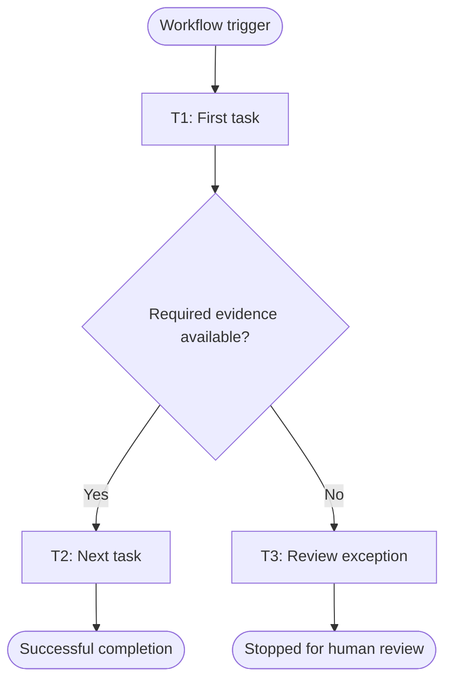

# Workflow of Tasks

*BUS 4498 Team Build Milestone 1. Save this file at `our_team_agent/agent/workflow-of-tasks.md` in `BUS4498_Team_Build`. Complete the prompts for your team's own problem. Remove these instructions and unused prompts before submitting.*

## 1. Workflow Goal

This workflow supports the goal in our completed [team charter](PASTE_CHARTER_FILE_URL_HERE).

*Open your completed charter file on GitHub, copy its address from the browser, and replace `PASTE_CHARTER_FILE_URL_HERE` with that address. Keep the charter in its existing location; do not create a second charter.*

## 2. Workflow Trigger

[State the event, request, schedule, or condition that starts one run.]

## 3. Completion Condition at Runtime

[State the observable condition that ends one run successfully. Identify what result or evidence must exist. This is different from the long-term target in your system goal.]

## 4. General Workflow

[Describe the normal sequence of tasks in one or two paragraphs. Then explain what happens when necessary information is missing, a tool fails, or a case requires human review. Identify what the person receives and whether the workflow stops or resumes after review.]

## 5. Workflow Diagram

*Replace the example diagram with your team's workflow. Give each work task a unique ID, such as T1, and a verb-object name, such as Retrieve Requests. Label branch conditions. Show human-review paths and stopping points. Use the same task IDs and names in the worksheet, task summary, and task specifications. Start/end markers and gateways that only route the flow are not work tasks.*

*The example labels are placeholders, not required project tasks. After editing, use GitHub Preview to check that the Mermaid diagram renders. Create a specification for every work task, including human-review tasks, and list each one in `task-summary.md`. Record automation levels and reasons only in the team worksheet.*
